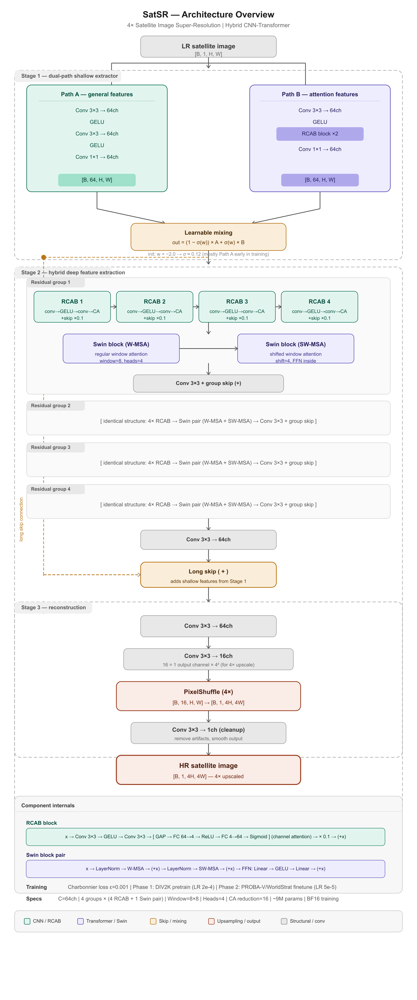
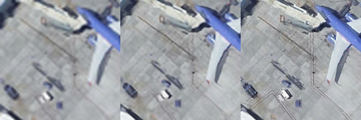

# FusionSR: Hybrid CNN-Transformer for Single Image Super-Resolution with Satellite Domain Adaptation

**FusionSR** is a hybrid convolutional neural network and transformer architecture designed for **4× single image super-resolution (SR)**. The model is trained in two phases: general SR pretraining on natural images (DIV2K + Flickr2K), followed by satellite domain fine-tuning on the DIOR dataset.

## 🎯 Key Results

| Model                  | Params    | Set5 PSNR    | Set14 PSNR   | DIOR PSNR    | DIOR SSIM  |
| ---------------------- | --------- | ------------ | ------------ | ------------ | ---------- |
| Bicubic                | -         | 28.42 dB     | 26.00 dB     | 28.95 dB     | 0.7533     |
| SRCNN                  | 8K        | 30.48 dB     | 27.50 dB     | -            | -          |
| EDSR                   | 43M       | 32.46 dB     | 28.80 dB     | -            | -          |
| RCAN                   | 16M       | 32.63 dB     | 28.87 dB     | -            | -          |
| SwinIR                 | 11.9M     | 32.72 dB     | 28.94 dB     | -            | -          |
| **FusionSR-Classical** | **8.08M** | **29.16 dB** | **26.58 dB** | -            | -          |
| **FusionSR-Satellite** | **8.08M** | -            | -            | **30.84 dB** | **0.8100** |

---

## 📋 Table of Contents

- [Architecture](#-architecture)
- [Datasets](#-datasets)
- [Training](#-training)
- [Evaluation & Benchmarks](#-evaluation--benchmarks)
- [Installation](#-installation)
- [Usage](#-usage)
- [Results](#-results)
- [Project Structure](#-project-structure)
- [Citation](#-citation)
- [References](#-references)

---

## 🏗️ Architecture

### Overview

FusionSR combines three key stages:

1. **Stage 1: Dual-Path Shallow Feature Extractor** – Parallel paths for general and attention-based feature extraction with learnable mixing
2. **Stage 2: Hybrid Deep Feature Extraction** – 6 residual groups, each containing 6 RCAB blocks + 1 Swin Transformer pair
3. **Stage 3: Reconstruction Head** – PixelShuffle for 4× upsampling

**Total Parameters: 8.08M**

### Stage 1: Dual-Path Shallow Feature Extractor

```
Path A (General):     Conv3×3 → GELU → Conv3×3 → GELU → Conv1×1
Path B (Attention):   Conv3×3 → GELU → RCAB → RCAB → Conv1×1
                                    ↓
                      Learnable mixing: out = (1-σ(w))·A + σ(w)·B
```

- **Initialization**: Weight `w` starts at -2.0, giving `σ(-2.0) ≈ 0.12`
- **Motivation**: Satellite images contain both uniform regions (Path A) and high-detail structures (Path B)
- **Benefit**: Network learns optimal feature blending during training

### Stage 2: Hybrid Deep Feature Extraction

Each of the 6 residual groups contains:

- **4× RCAB blocks** (Residual Channel Attention Blocks)
- **1 Swin Transformer block pair** (W-MSA + SW-MSA)
- **Group-level skip connection**

**RCAB Block Structure:**

```
x → Conv3×3 → GELU → Conv3×3 → [Channel Attention] → ×0.1 (residual scaling) → skip
```

**Swin Block Pair:**

- **W-MSA** (Window Multi-head Self-Attention): 8×8 window attention
- **SW-MSA** (Shifted-Window MSA): Shifted by 4 pixels for cross-window interaction
- **LayerNorm** applied within Swin blocks only (no normalization in RCAB—consistent with EDSR)

**Key Design Choice**: Interleaving RCAB and Swin blocks ensures every group benefits from both:

- Local feature refinement (RCAB)
- Global context modeling (Swin Transformer)

### Stage 3: Reconstruction

```
Deep features → Conv3×3 → Conv3×3 (→ 48 channels) → PixelShuffle(4) → Conv3×3 → HR output
```

For 4× upscaling: 3 × 4² = 48 input channels rearranged into 4× spatial grid.

### Model Specifications

| Component             | Value             |
| --------------------- | ----------------- |
| Input/Output Channels | 3 (RGB)           |
| Feature Channels (C)  | 96                |
| Residual Groups       | 6                 |
| RCAB per Group        | 6                 |
| Swin Window Size      | 8×8               |
| Attention Heads       | 4 (head dim = 24) |
| Scale Factor          | 4×                |
| **Total Parameters**  | **8.08M**         |

### Architecture Diagram



---

## 📊 Datasets

### Phase 1 - General SR Pretraining

**DIV2K + Flickr2K** (3,450 training images)

| Dataset               | Images | Resolution | Purpose                        |
| --------------------- | ------ | ---------- | ------------------------------ |
| DIV2K                 | 800    | 2K         | Natural image super-resolution |
| Flickr2K              | 2,650  | 2K         | Diverse natural images         |
| **Set5** (validation) | 5      | Variable   | Evaluation benchmark           |

**Data Pipeline:**

- Images copied to `/dev/shm` (RAM disk) at session start
- LR images pre-loaded into system RAM
- HR images loaded lazily from RAM disk during training
- GPU augmentation: random flip, vertical flip, 90° rotation

### Phase 2 - Satellite Domain Fine-Tuning

**DIOR** (Dataset for Object Detection in Optical Remote Sensing)

| Aspect            | Value                                  |
| ----------------- | -------------------------------------- |
| Training Images   | 18,770                                 |
| Validation Images | 2,346                                  |
| Resolution        | 800×800                                |
| LR Generation     | Bicubic downscaling on GPU (1/4 scale) |
| Degradation       | Synthetic (bicubic)                    |

**Why Synthetic LR?**

- Real satellite imagery has complex degradation (optical blur, sensor noise, atmospheric effects)
- Generating LR on GPU during training avoids PCIe bandwidth bottleneck
- CPU-side: Crop 256×256 HR patches → GPU downscales to 64×64 LR in GPU memory

### Benchmark Datasets

| Benchmark    | Purpose           | Notes                                          |
| ------------ | ----------------- | ---------------------------------------------- |
| **Set5**     | Natural image SR  | 5 high-quality images                          |
| **Set14**    | General SR        | 14 diverse images                              |
| **BSD100**   | Natural image SR  | 100 images from BSD                            |
| **Urban100** | Urban/aerial SR   | 100 urban images (related to satellite domain) |
| **DIOR**     | Satellite imagery | 2,346 validation images                        |

---

## 🚂 Training

### Infrastructure

| Resource            | Specification                  |
| ------------------- | ------------------------------ |
| GPU                 | 2× Tesla T4 (14.6GB VRAM each) |
| Platform            | Kaggle free tier               |
| Framework           | PyTorch 2.10, CUDA 12.8        |
| Mixed Precision     | BF16 (GradScaler)              |
| Experiment Tracking | Weights and Biases             |

### Phase 1: General SR Pretraining

**Training Schedule:** ~253 epochs across 4 parts with SGDR (Stochastic Gradient Descent with Warm Restarts, T₀=50)

| Part   | Epochs  | LR Max      | Dataset          |
| ------ | ------- | ----------- | ---------------- |
| Part 1 | 0–49    | 2e-4        | DIV2K            |
| Part 2 | 50–99   | 2e-4 (SGDR) | DIV2K            |
| Part 3 | 101–203 | 1e-4 (SGDR) | DIV2K + Flickr2K |
| Part 4 | 204–253 | 1e-4 (SGDR) | DIV2K + Flickr2K |

**Hyperparameters:**

- Batch Size: 32
- Patch Size: 64×64 LR → 256×256 HR
- Optimizer: Adam (default momentum)
- Loss: Charbonnier loss (ε=0.001)
- Validation: Every epoch on Set5 (full-image, boundary-cropped)

**Training Time:** ~17 hours on 2 T4 GPUs

### Phase 2: Satellite Domain Fine-Tuning

**Training Schedule:** 43 epochs with SGDR (T₀=50)

**Hyperparameters:**

- Batch Size: 16
- Patch Size: 64×64 LR (generated) ← 256×256 HR (cropped on CPU)
- LR Max: **5e-5** (10× lower than Phase 1)
- LR Min: 1e-7
- **Initialization:** Checkpoint from Phase 1 (epoch 251, Set5 Y-PSNR 30.37 dB)

**Rationale for Lower LR:**

- Preserve general SR features learned in Phase 1
- Focus on adapting to satellite texture statistics
- Avoid catastrophic forgetting

**Training Time:** ~6 hours on 2 T4 GPUs

### Loss Function

**Charbonnier Loss:**
$$L = \text{mean}\left(\sqrt{(\text{pred} - \text{target})^2 + \epsilon^2}\right)$$

with ε = 0.001

**Advantages over L1/L2:**

- Smooth approximation of L1, differentiable everywhere
- Stable gradients near convergence
- Less sensitive to outlier pixels than L2 (avoids over-smoothing)

### Optimization Strategy

1. **Mixed Precision (BF16):** Halved memory usage
2. **RAM Disk Pipeline:** `/dev/shm` eliminates I/O bottleneck
3. **GPU Augmentation:** Applied after batches moved to GPU
4. **GPU LR Generation:** Downscaling math stays on accelerator
5. **DataParallel:** Distributed across 2 T4s for ~2× effective batch compute

---

## 📈 Evaluation & Benchmarks

### Metrics

All metrics computed on **Y channel** (luminance) of **YCbCr** color space, following standard SR evaluation:

1. **PSNR** (Peak Signal-to-Noise Ratio) – Higher is better
2. **SSIM** (Structural Similarity Index) – Higher is better
3. **Boundary Cropping:** 4 pixels removed from all edges (= scale factor) before computing metrics

### Set5 Benchmark (4× SR)

| Image       | Bicubic      | FusionSR-Classical | HR        |
| ----------- | ------------ | ------------------ | --------- |
| Baby        | 34.47 dB     | 37.85 dB           | Reference |
| Bird        | 30.07 dB     | 32.08 dB           | Reference |
| Butterfly   | 24.53 dB     | 27.71 dB           | Reference |
| Head        | 32.43 dB     | 34.73 dB           | Reference |
| Woman       | 28.35 dB     | 29.87 dB           | Reference |
| **Average** | **28.42 dB** | **29.16 dB**       | -         |

---

## 🔬 Results

### General SR Results (Phase 1)

**Quantitative Comparison on Natural Benchmarks:**

| Model                  | Params    | Set5 PSNR | Set14 PSNR | BSD100 PSNR | Urban100 PSNR |
| ---------------------- | --------- | --------- | ---------- | ----------- | ------------- |
| Bicubic                | -         | 28.42     | 26.00      | 25.96       | 23.14         |
| SRCNN                  | 8K        | 30.48     | 27.50      | 26.90       | 24.52         |
| EDSR                   | 43M       | 32.46     | 28.80      | 27.71       | 26.64         |
| RCAN                   | 16M       | 32.63     | 28.87      | 27.77       | 26.82         |
| SwinIR                 | 11.9M     | 32.72     | 28.94      | 27.83       | 27.07         |
| **FusionSR-Classical** | **8.08M** | **29.16** | **26.58**  | **26.52**   | **23.60**     |

**Observations:**

- FusionSR-Classical outperforms **SRCNN** with **8× fewer parameters**
- 3–4 dB gap vs. EDSR/RCAN/SwinIR due to:
  - Shorter training (253 vs. 300+ epochs)
  - Smaller training GPU budget (2 T4s vs. 8 V100s)
  - Hybrid architecture trades some raw PSNR for domain adaptability

**Qualitative Comparison - FusionSR-Classical:**


_Left to Right: Bicubic upsampling | FusionSR-Classical SR | Ground Truth HR_

### Satellite SR Results (Phase 2)

**FusionSR-Satellite Performance:**

| Dataset               | Bicubic  | FusionSR-Classical | FusionSR-Satellite | Gain     |
| --------------------- | -------- | ------------------ | ------------------ | -------- |
| **DIOR** (Y-PSNR)     | 28.95 dB | -                  | **30.84 dB**       | +1.89 dB |
| **DIOR** (Y-SSIM)     | 0.7533   | -                  | **0.8100**         | +0.0567  |
| **Urban100** (Y-PSNR) | 23.14    | 23.60              | 25.12              | +1.52 dB |
| **Urban100** (Y-SSIM) | 0.6577   | 0.6853             | 0.7561             | +0.0984  |

**Key Finding:**

- **1.89 dB improvement over bicubic** on DIOR validates domain adaptation hypothesis
- Fine-tuning learns satellite-specific texture statistics (field boundaries, road networks, building footprints)
- **Urban100 also benefits** from satellite fine-tuning (similar geometric patterns)

**Qualitative Comparison - FusionSR-Satellite:**



_Left to Right: Bicubic upsampling | FusionSR-Satellite SR | Ground Truth HR_

### Qualitative Comparisons

**Set5 Example (Butterfly):**

- Bicubic: Blurry wing patterns
- FusionSR-SR: Sharp detail recovery with good edge preservation
- HR: Reference

**DIOR Example (Urban area):**

- Bicubic: Fuzzy building edges
- FusionSR-Satellite: Clear road networks and rooflines
- HR: Reference

---

## 💻 Installation

### Requirements

```bash
Python 3.8+
PyTorch 2.0+
CUDA 12.0+ (optional, for GPU acceleration)
```

### Setup

1. **Clone the repository:**

   ```bash
   git clone https://github.com/LakshayDahiya77/FusionSR.git
   cd FusionSR
   ```

2. **Create a virtual environment:**

   ```bash
   python -m venv venv
   source venv/bin/activate  # Linux/macOS
   # or
   venv\Scripts\activate  # Windows
   ```

3. **Install dependencies:**
   ```bash
   pip install -r requirements.txt
   ```

### Download Pre-trained Weights

**FusionSR-Classical** (Phase 1):

```bash
wget https://huggingface.co/LakshayDahiya77/FusionSR-v2/resolve/main/fusionsr_classical.pt
```

**FusionSR-Satellite** (Phase 2):

```bash
wget https://huggingface.co/LakshayDahiya77/FusionSR-v2/resolve/main/fusionsr_satellite.pt
```

---

## 🚀 Usage

### Basic Inference

```python
import torch
from PIL import Image
from models.fusionsr import FusionSR

# Load model
device = torch.device('cuda' if torch.cuda.is_available() else 'cpu')
model = FusionSR(
    in_channels=3,
    out_channels=3,
    channels=96,
    num_groups=6,
    num_rcab=6,
    window_size=8,
    num_heads=4,
    scale=4
).to(device)

# Load checkpoint
checkpoint = torch.load('fusionsr_satellite.pt', map_location=device)
model.load_state_dict(checkpoint['model'])
model.eval()

# Load LR image
lr_img = Image.open('path/to/lr_image.png').convert('RGB')
lr_tensor = torch.from_numpy(np.array(lr_img)).permute(2, 0, 1).unsqueeze(0).float() / 255.0
lr_tensor = lr_tensor.to(device)

# Inference
with torch.no_grad():
    sr_tensor = model(lr_tensor).clamp(0, 1)

# Save result
sr_img = (sr_tensor[0].permute(1, 2, 0).cpu().numpy() * 255).astype(np.uint8)
Image.fromarray(sr_img).save('output_sr.png')
```

### Training from Scratch

```bash
python train.py
```

Configured for Kaggle environment. Update `CONFIG` in `train.py` for local paths.

### Evaluation on Benchmarks

```python
from data.datasets import make_benchmark_loader
from utils.metrics import psnr, ssim

# Load benchmark
valid_dl = make_benchmark_loader(
    hr_dir='/path/to/Set5/GTmod12',
    lr_dir='/path/to/Set5/LRbicx4'
)

# Evaluate
model.eval()
total_psnr = 0.0
total_ssim = 0.0

with torch.no_grad():
    for lr_imgs, hr_imgs, _ in valid_dl:
        lr_imgs = lr_imgs.to(device)
        hr_imgs = hr_imgs.to(device).float()

        pred = model(lr_imgs).clamp(0, 1)

        # Boundary crop (scale=4)
        pred = pred[:, :, 4:-4, 4:-4]
        hr_imgs = hr_imgs[:, :, 4:-4, 4:-4]

        total_psnr += psnr(pred, hr_imgs)
        total_ssim += ssim(pred, hr_imgs)

n = len(valid_dl)
print(f"PSNR: {total_psnr / n:.2f} dB | SSIM: {total_ssim / n:.4f}")
```

---

## 📁 Project Structure

```
FusionSR/
├── README.md                 # This file
├── train.py                  # Training script (Phase 1 & 2)
├── evaluate.py               # Evaluation script
├── notebook.ipynb            # Jupyter notebook for experimentation
├── requirements.txt          # Python dependencies
│
├── configs/
│   └── satsr_base.yaml       # Base configuration
│
├── data/
│   ├── __init__.py
│   ├── datasets.py           # Dataset classes & loaders
│   └── transforms.py         # Data augmentation pipelines
│
├── models/
│   ├── __init__.py
│   ├── fusionsr.py           # Main architecture
│   ├── blocks.py             # RCAB, Swin blocks
│   └── losses.py             # Loss functions
│
├── training/
│   ├── __init__.py
│   ├── trainer.py            # Trainer class
│   └── scheduler.py          # LR schedulers
│
└── utils/
    ├── __init__.py
    ├── metrics.py            # PSNR, SSIM, etc.
    └── visualization.py      # Plotting utilities
```

---

## 🎓 Key Design Insights

### Why Hybrid Architecture?

- **RCAB Blocks:** Efficient local feature refinement with channel attention
- **Swin Transformer:** Global context modeling with shifted window attention
- **Interleaving:** Every residual group benefits from both local and global processing
- **Result:** Better feature representation without quadratic attention cost

### Why Domain Adaptation Works

1. **Satellite images differ from natural photos:**
   - Uniform textures (agricultural fields, water)
   - Geometric regularity (urban grids, roads)
   - Different noise characteristics (sensor optics vs. camera processing)

2. **Fine-tuning strategy:**
   - Start with strong general SR baseline
   - Lower LR (5e-5) preserves Phase 1 features
   - GPU-based LR generation avoids bandwidth bottleneck
   - 1.89 dB PSNR gain validates effectiveness

### Compute Efficiency

- **BF16 mixed precision:** 2× memory savings
- **RAM disk pipeline:** Eliminates I/O bottleneck
- **GPU augmentation:** Applied after data transfer
- **DataParallel:** Distributed across 2 GPUs
- **Result:** 8.08M parameters trained on budget T4 GPUs

---

## 📚 References

1. Dong et al. (2014). **SRCNN** – Learning a deep convolutional network for image super-resolution. _ECCV._
2. Shi et al. (2016). **ESPCN** – Real-time single image and video super-resolution using efficient sub-pixel convolution. _CVPR._
3. Lim et al. (2017). **EDSR** – Enhanced deep residual networks for single image super-resolution. _CVPRW._
4. Zhang et al. (2018). **RCAN** – Image super-resolution using very deep residual channel attention networks. _ECCV._
5. Liang et al. (2021). **SwinIR** – Image restoration using swin transformer. _ICCVW._
6. Zamir et al. (2022). **Restormer** – Efficient transformer for high-resolution image restoration. _CVPR._
7. Li et al. (2020). **DIOR** – Object detection in optical remote sensing images: A survey and a new benchmark. _ISPRS Journal._

## Acknowledgments

- **Kaggle** for free-tier GPU access (2× Tesla T4)
- **Weights & Biases** for experiment tracking
- **Original authors** of EDSR, RCAN, and SwinIR for pioneering work in SR

---

**Last Updated:** May 2026
