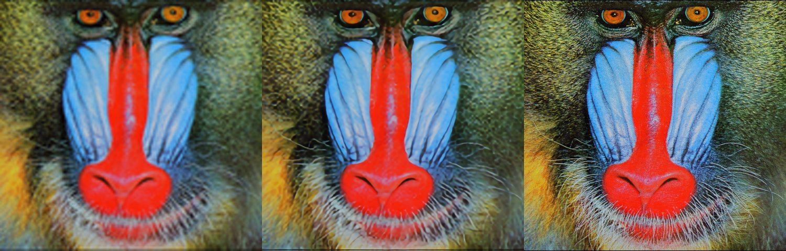
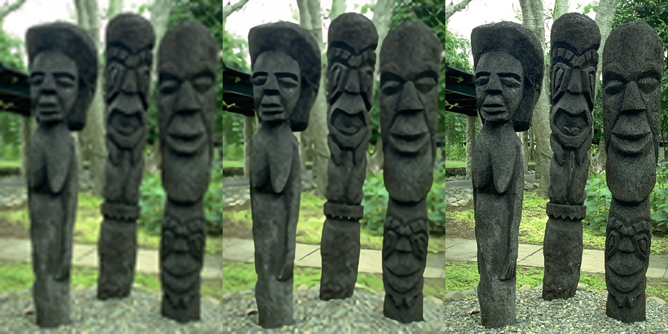
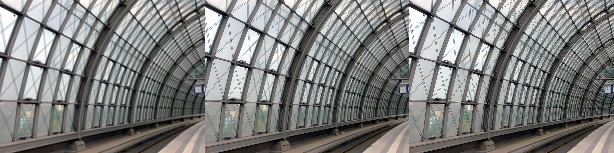
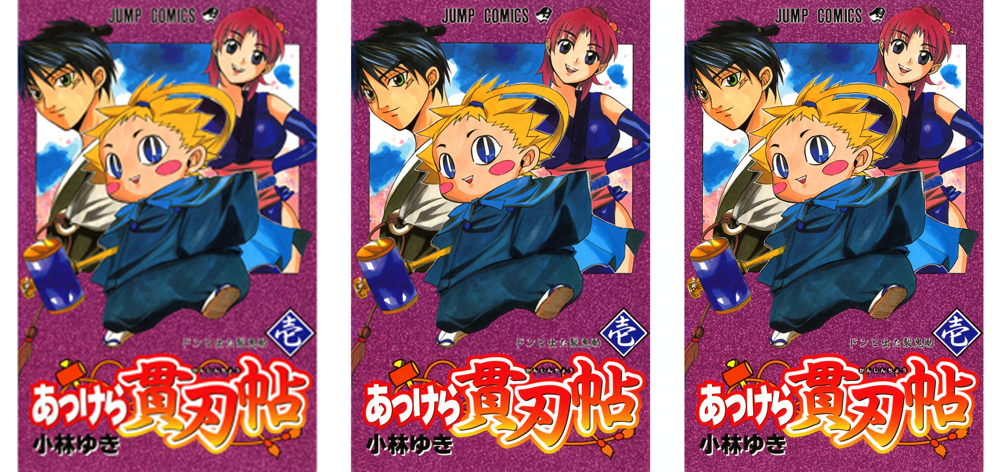

# FusionSR-v4: Advanced Hybrid CNN-Transformer for Single Image Super-Resolution

**FusionSR-v4** is a heavyweight hybrid convolutional neural network and transformer architecture (~32.23M parameters) designed for **4× single image super-resolution (SR)**. This major version upgrade introduces a larger channel capacity, larger Swin attention windows, and a novel **Overlapping Cross-Attention (OCA)** mechanism to drastically improve cross-window feature aggregation and high-frequency texture recovery.

## 🎯 Key Results (4× Upscaling)

| Model           | Params    | Set5 (PSNR / SSIM) | Set14 (PSNR / SSIM) | BSD100 (PSNR / SSIM) | Urban100 (PSNR / SSIM) | Manga109 (PSNR / SSIM) |
| --------------- | --------- | ------------------ | ------------------- | -------------------- | ---------------------- | ---------------------- |
| Bicubic         | -         | 28.42 / 0.8104     | 26.00 / 0.7027      | 25.96 / 0.6675       | 23.14 / 0.6577         | 24.89 / 0.7866         |
| SRCNN           | 8K        | 30.48 / 0.8628     | 27.50 / 0.7513      | 26.90 / 0.7101       | 24.52 / 0.7221         | 27.58 / 0.8555         |
| EDSR            | 43M       | 32.46 / 0.8968     | 28.80 / 0.7876      | 27.71 / 0.7420       | 26.64 / 0.8033         | 31.02 / 0.9148         |
| RCAN            | 16M       | 32.63 / 0.9002     | 28.87 / 0.7889      | 27.77 / 0.7436       | 26.82 / 0.8087         | 31.22 / 0.9173         |
| SwinIR          | 11.9M     | 32.93 / 0.9043     | 29.15 / 0.7958      | 27.95 / 0.7494       | 27.56 / 0.8273         | 32.22 / 0.9273         |
| **FusionSR-v4** | **32.2M** | **32.06 / 0.8973** | **28.54 / 0.7869**  | **27.53 / 0.7437**   | **25.94 / 0.7841**     | **30.18 / 0.9066**     |

---

## 📋 Table of Contents

- [Architecture](#-architecture)
- [Datasets](#-datasets)
- [Training Strategy](#-training-strategy)
- [Results](#-results)
- [Model Weights](#-model-weights)
- [Installation & Usage](#-installation--usage)

---

## 🏗️ Architecture

### Overview

FusionSR-v4 has been redesigned to maximize receptive field and feature flow. The network consists of three main stages:

1. **Stage 1: Shallow Feature Extractor** – Standard 3×3 Convolution mapping input to 180 channels.
2. **Stage 2: Deep Feature Extraction** – 6 heavy Residual Groups featuring HAT-inspired Cross-Attention.
3. **Stage 3: Progressive Reconstruction** – Two-stage PixelShuffle (2× → 2× = 4×) to prevent checkerboard artifacts.

**Total Parameters: ~32.23M**

### Stage 2: The v4 Residual Group

The repeating unit of Stage 2 has been heavily upgraded from previous versions. Each of the 6 Residual Groups contains:

```text
x → [RCAB × 6] → [Channel Attention Bridge] → [SwinBlockPair] → [Overlapping Cross-Attention] → Conv3×3 → skip
```

- **RCAB Stack**: 6 Residual Channel Attention Blocks for local CNN feature extraction.
- **Channel Attention Bridge (CAB)**: A global channel bridge inspired by HAT that aggregates information across all spatial positions before transformer processing.
- **SwinBlockPair**: Window Multi-head Self-Attention (W-MSA) followed by Shifted-Window MSA (SW-MSA). Integrates a Gated-DConv Feed-Forward Network (GDFN).
- **Overlapping Cross-Attention (OCA)**: **[NEW]** Extends the key/value context by extracting larger, overlapping windows (overlap=4). Allows queries to attend to neighboring pixels beyond their rigid window boundaries without relying solely on the shift mechanism.

### Model Specifications

| Component             | Value             |
| --------------------- | ----------------- |
| Input/Output Channels | 3 (RGB)           |
| Feature Channels (C)  | 180               |
| Residual Groups       | 6                 |
| RCAB per Group        | 6                 |
| Swin Window Size      | 16×16             |
| OCA Overlap           | 4                 |
| Attention Heads       | 6 (head dim = 30) |
| FFN Expansion         | 2.0               |
| Scale Factor          | 4×                |
| **Total Parameters**  | **~32.23M**       |

### Architecture Diagram



---

## 📊 Datasets

### Training Data

The model is trained entirely on the standard **DF2K** dataset, which provides a robust and diverse set of high-resolution natural images.

| Dataset            | Images | Purpose                       |
| ------------------ | ------ | ----------------------------- |
| **DIV2K**          | 800    | High-quality natural image SR |
| **Flickr2K**       | 2,650  | Diverse natural textures      |
| **Total Training** | 3,450  | DF2K Combined                 |

### Validation Data

During the training phase, the model's structural fidelity and convergence are monitored exclusively using the **Set5** dataset to ensure rapid validation turnaround times without bottlenecking the GPU pipeline.

---

## 🚂 Training Strategy

The model leverages a dynamic optimization strategy to navigate the complex loss landscape of a 32M+ parameter hybrid network.

- **Optimizer:** AdamW ($\beta_1=0.9, \beta_2=0.999$) with weight decay.
- **Loss Function:** Charbonnier Loss ($\epsilon=1e-3$).
- **Learning Rate Scheduler:** We utilize **Stochastic Gradient Descent with Warm Restarts (SGDR)**. The learning rate strictly follows a Cosine Annealing decay profile, smoothly decaying from a targeted $LR_{max}$ down to a $LR_{min}$ (e.g., $1e-7$).
- **Gradient Clipping:** Capped at 0.5 to maintain transformer stability.
- **Precision:** Mixed precision training utilized dynamically via `torch.autocast`.

---

## 🔬 Benchmark Results

All metrics are computed on the **Y channel** (luminance) of the **YCbCr** color space, following standard SR evaluation protocol. A boundary crop equal to the scale factor (4 pixels) is removed from all edges prior to calculating PSNR and SSIM.

| Benchmark    | PSNR (Y) | SSIM (Y) |
| ------------ | -------- | -------- |
| **Set5**     | 32.06 dB | 0.8973   |
| **Set14**    | 28.54 dB | 0.7869   |
| **BSD100**   | 27.53 dB | 0.7437   |
| **Manga109** | 30.18 dB | 0.9066   |
| **Urban100** | 25.94 dB | 0.7841   |

### Qualitative Comparisons

Below are visual super-resolution results on various datasets showing the low-resolution input (left), the **FusionSR-v4** output (middle), and the ground-truth high-resolution image (right):

| Dataset | Visual Comparison: Low-Res (Left) vs. FusionSR-v4 Output (Middle) vs. Ground Truth (Right) |
| :---: | :--- |
| **Set5** |  |
| **Set14** |  |
| **BSD100** |  |
| **Urban100** |  |
| **Manga109** |  |

---

## 📦 Model Weights

The pre-trained weights for **FusionSR-v4** are hosted on Hugging Face:

👉 **[FusionSR-v4 Model Weights on Hugging Face](https://huggingface.co/datasets/lakshaydahiya/FusionSR-v4)**

You can download the model checkpoint file `FusionSR-v4 weight-Best79.pt` from this repository and place it in the project root directory before running inference.

---

## 💻 Installation & Usage

### Setup

1. **Clone the repository:**

```bash
git clone -b v4 https://github.com/LakshayDahiya77/FusionSR.git
cd FusionSR
```

2. **Install dependencies:**

```bash
pip install -r requirements.txt
```

### Basic Inference

```python
import torch
from PIL import Image
import numpy as np
from models.fusionsr import FusionSR

device = torch.device('cuda' if torch.cuda.is_available() else 'cpu')

# Initialize v4 Architecture
model = FusionSR(
    in_channels=3, out_channels=3, channels=180, num_groups=6,
    num_rcab=6, window_size=16, num_heads=6, scale=4,
    ffn_expansion=2.0, oca_overlap=4
).to(device)

# Load weights
ckpt = torch.load('FusionSR-v4 weight-Best79.pt', map_location=device)
model.load_state_dict(ckpt['model'] if 'model' in ckpt else ckpt)
model.eval()

# Process Image (Note: Model dynamically handles window padding)
img = Image.open('input.png').convert('RGB')
lr_tensor = torch.from_numpy(np.array(img)).permute(2, 0, 1).unsqueeze(0).float() / 255.0

with torch.no_grad(), torch.autocast("cuda", dtype=torch.float16):
    sr_tensor = model(lr_tensor.to(device)).clamp(0, 1)

# Save
sr_img = (sr_tensor[0].permute(1, 2, 0).cpu().numpy() * 255).astype(np.uint8)
Image.fromarray(sr_img).save('output_sr.png')
```
