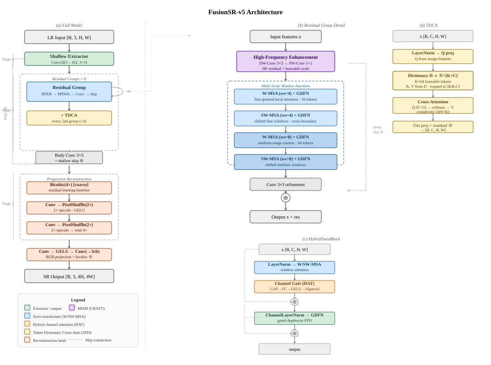

# FusionSR-v5: Efficient Hybrid CNN-Transformer for Single Image Super-Resolution

**FusionSR-v5** is a lightweight hybrid architecture (~14M parameters) for **4× single image super-resolution**. It combines novel multi-scale windowed self-attention, explicit high-frequency enhancement, global token dictionary cross-attention, and integrated channel gating — achieving competitive results against heavier published models at significantly lower parameter cost.

## 🎯 Key Results (4× Upscaling)

| Model           | Params    | Set5 (PSNR / SSIM) | Set14 (PSNR / SSIM) | BSD100 (PSNR / SSIM) | Urban100 (PSNR / SSIM) | Manga109 (PSNR / SSIM) |
| --------------- | --------- | ------------------ | ------------------- | -------------------- | ---------------------- | ---------------------- |
| Bicubic         | —         | 28.42 / 0.8104     | 26.00 / 0.7027      | 25.96 / 0.6675       | 23.14 / 0.6577         | 24.89 / 0.7866         |
| SRCNN           | 8K        | 30.48 / 0.8628     | 27.50 / 0.7513      | 26.90 / 0.7101       | 24.52 / 0.7221         | 27.58 / 0.8555         |
| EDSR            | 43M       | 32.46 / 0.8968     | 28.80 / 0.7876      | 27.71 / 0.7420       | 26.64 / 0.8033         | 31.02 / 0.9148         |
| RCAN            | 16M       | 32.63 / 0.9002     | 28.87 / 0.7889      | 27.77 / 0.7436       | 26.82 / 0.8087         | 31.22 / 0.9173         |
| SwinIR          | 11.9M     | 32.93 / 0.9043     | 29.15 / 0.7958      | 27.95 / 0.7494       | 27.56 / 0.8273         | 32.22 / 0.9273         |
| **FusionSR-v5** | **14.0M** | **32.38 / 0.9016** | **28.82 / 0.7938**  | **27.72 / 0.7496**   | **26.54 / 0.8025**     | **30.99 / 0.9168**     |

> Results evaluated on Y-channel (YCbCr), boundary-cropped by scale factor, matching standard SR evaluation protocol.

---

## 📋 Table of Contents

- [Architecture](#-architecture)
- [Novel Components](#-novel-components)
- [Datasets](#-datasets)
- [Training Strategy](#-training-strategy)
- [Results](#-results)
- [Model Weights](#-model-weights)
- [Installation & Usage](#-installation--usage)

---

## 🏗️ Architecture

### Overview

FusionSR-v5 consists of three stages:

1. **Stage 1: Shallow Feature Extractor** — Single 3×3 convolution mapping input to 162 channels.
2. **Stage 2: Deep Feature Extraction** — 8 Residual Groups, each containing a High-Frequency Enhancement Branch (HFEB), Multi-Scale Window Attention (MSWA), and a refinement convolution. Token Dictionary Cross-Attention (TDCA) is inserted after every 2nd group (×4 instances) for global self-similarity matching.
3. **Stage 3: Progressive Reconstruction** — Residual upsampling over a bicubic baseline via two sequential 2×+2× PixelShuffle steps.

**Total Parameters: ~14.00M**

### Architecture Diagram

<!-- Insert fusionsr_v5_architecture.svg here -->



### Residual Group Structure

Each of the 8 Residual Groups follows the topology:

```
x → HFEB → [MSWA: W-MSA(ws=4) → SW-MSA(ws=4) → W-MSA(ws=8) → SW-MSA(ws=8)] → Conv3×3 → + skip
```

After every 2nd group, a Token Dictionary Cross-Attention layer is appended before the next group.

### HybridSwinBlock

Each attention block within MSWA integrates HAT-style channel gating directly on the attention output:

```
x → LayerNorm → W/SW-MSA → ChannelGate(GAP→FC→GELU→Sigmoid) → ⊕ skip
  → ChannelLayerNorm → GDFN → ⊕ skip
```

### Model Specifications

| Component            | Value                     |
| -------------------- | ------------------------- |
| Input / Output       | 3 channels (RGB)          |
| Feature Channels (C) | 162                       |
| Residual Groups      | 8                         |
| Blocks per Group     | 4 (2 pairs)               |
| Window Sizes (MSWA)  | 4×4 (fine) + 8×8 (medium) |
| TDCA Instances       | 4 (every 2nd group)       |
| TDCA Dictionary Size | 64 tokens                 |
| Attention Heads      | 6 (head dim = 27)         |
| FFN Expansion        | 2.0                       |
| Scale Factor         | 4×                        |
| **Total Parameters** | **~14.00M**               |

---

## 🔬 Novel Components

### High-Frequency Enhancement Branch (HFEB)

Inspired by CRAFT (Li et al., ICCV 2023). Replaces heavyweight RCAB stacks with a lightweight depthwise-pointwise convolution that explicitly extracts the high-frequency residual (`local_features − input`) and re-weights it with a learnable per-channel scale. Addresses the low-frequency bias inherent in transformer attention. Cost: ~60K params per group vs ~3.5M for 6 RCABs.

### Multi-Scale Window Attention (MSWA)

A novel combination not present in any published SR model. All existing windowed-attention SR models (SwinIR, HAT, DRCT) use a single fixed window size. MSWA alternates between ws=4 (fine local edges, 16 tokens) and ws=8 (medium-range structural patterns, 64 tokens) within the same Residual Group, providing multi-scale receptive fields at no additional parameter cost.

### Hybrid Channel Attention (HAT-inspired)

Integrates squeeze-excite channel gating _inside_ each transformer block, applied directly to the attention output before the residual addition. Unlike v4's separate Channel Attention Bridge stage, this creates per-block spatial-channel fusion — the channel gate learns which spatial attention channels to amplify.

### Token Dictionary Cross-Attention (TDCA)

Inspired by ATD (Li et al., CVPR 2024). A shared learnable token dictionary `D ∈ ℝ^{K×C}` (K=64) enables global self-similarity matching with O(N×K) complexity — linear in spatial size, versus O(N²) for full self-attention. Image features query the dictionary, enabling distant regions with identical patterns to share representation implicitly.

---

## 📊 Datasets

### Training Data

| Dataset        | Images    | Purpose                  |
| -------------- | --------- | ------------------------ |
| DIV2K          | 800       | High-quality natural SR  |
| Flickr2K       | 2,650     | Diverse natural textures |
| **DF2K Total** | **3,450** | Combined training set    |

LR images generated via bicubic downsampling (×4). Augmentation: random horizontal/vertical flip and 90° rotations. LR patch size: 128×128.

### Validation Data

Urban100 is used as the primary validation benchmark during training, directly optimizing for the hardest standard SR benchmark (repetitive man-made structures, sharp edges, long-range self-similarity).

---

## 🚂 Training Strategy

- **Optimizer:** AdamW (β₁=0.9, β₂=0.999, weight decay=0.01)
- **Loss Function:** Charbonnier Loss (ε=1e-3)
- **LR Schedule:** Cosine decay with linear warmup (5 epochs), lr_max=3e-4, min_lr=1e-7
- **Gradient Clipping:** max norm = 1.0
- **Precision:** bfloat16 mixed precision via `torch.autocast`
- **Batch Size:** 12–32 depending on GPU (effective batch tuned per hardware)

---

## 🔬 Benchmark Results

All metrics computed on Y-channel (YCbCr), with boundary crop equal to scale factor (4 pixels per edge).

| Benchmark    | PSNR (Y) | SSIM (Y) |
| ------------ | -------- | -------- |
| **Set5**     | 32.38 dB | 0.9016   |
| **Set14**    | 28.82 dB | 0.7938   |
| **BSD100**   | 27.72 dB | 0.7496   |
| **Urban100** | 26.54 dB | 0.8025   |
| **Manga109** | 30.99 dB | 0.9168   |

### Qualitative Comparisons

<!-- Insert benchmark comparison images below -->

|   Dataset    | Visual Comparison: Low-Res (Left) vs. FusionSR-v4 Output (Middle) vs. Ground Truth (Right) |
| :----------: | :----------------------------------------------------------------------------------------- |
|   **Set5**   |               |
|  **Set14**   |             |
|  **BSD100**  |           |
| **Urban100** |       |
| **Manga109** |       |

---

## 📦 Model Weights

Pre-trained weights are hosted on Hugging Face:

👉 **[FusionSR-v5 Model Weights on Hugging Face](https://huggingface.co/lakshaydahiya/FusionSR-v5)**

Download `fusionsr-v5-best.pt` and place it in the project root before running inference.

---

## 💻 Installation & Usage

### Setup

```bash
git clone -b v5 https://github.com/LakshayDahiya77/FusionSR.git
cd FusionSR
pip install -r requirements.txt
```

### Basic Inference

```python
import torch
from PIL import Image
import numpy as np
from models.fusionsr import FusionSR

device = torch.device('cuda' if torch.cuda.is_available() else 'cpu')

# Initialize v5 architecture
model = FusionSR(
    channels=162,
    num_groups=8,
    num_heads=6,
    scale=4,
    ffn_expansion=2.0,
    use_hfeb=True,
    use_hybrid_ca=True,
    use_mswa=True,
    use_tdca=True,
    tdca_num_tokens=64,
    tdca_interval=2,
    hf_scale_init=0.01,
).to(device)

# Load weights
ckpt = torch.load('fusionsr-v5-best.pt', map_location=device)
model.load_state_dict(ckpt['model'] if 'model' in ckpt else ckpt)
model.eval()

# Process image
img = Image.open('input.png').convert('RGB')
lr_tensor = torch.from_numpy(np.array(img)).permute(2, 0, 1).unsqueeze(0).float() / 255.0

with torch.no_grad(), torch.autocast('cuda', dtype=torch.bfloat16):
    sr_tensor = model(lr_tensor.to(device)).float().clamp(0, 1)

sr_img = (sr_tensor[0].permute(1, 2, 0).cpu().numpy() * 255).astype(np.uint8)
Image.fromarray(sr_img).save('output_sr.png')
```

### Command-line Inference

```bash
python inference.py --input image.png --checkpoint fusionsr-v5-best.pt
```

### Benchmarking

```bash
python evaluate.py --checkpoint fusionsr-v5-best.pt
```
